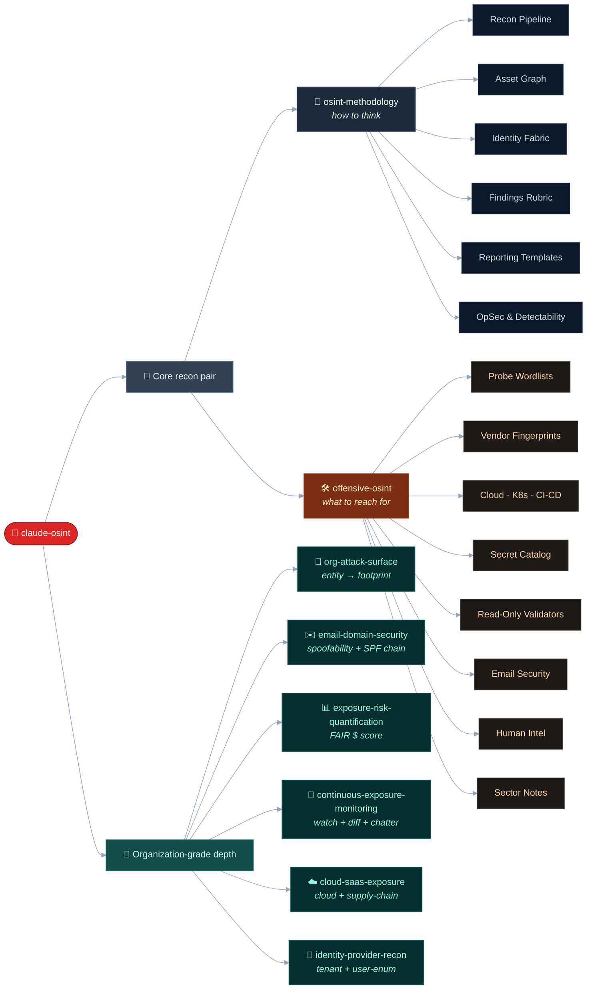
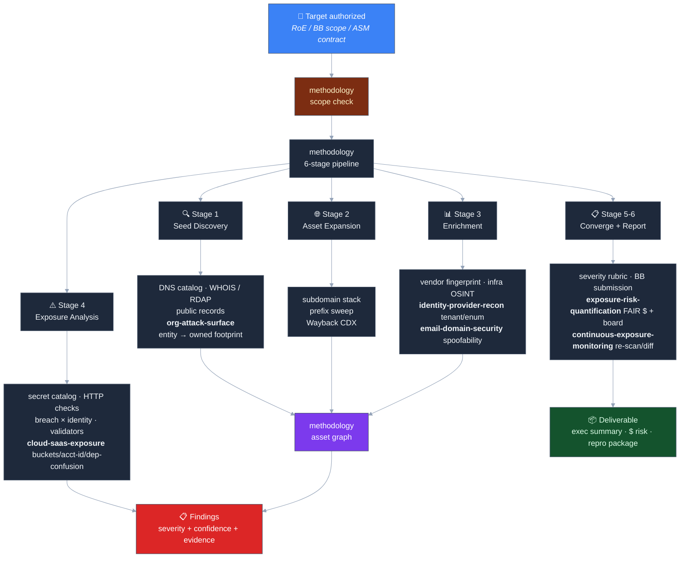

# claude-osint

> **8 Claude skills** · 100+ recon capabilities · 80 secret-regex patterns · 80+ dorks · 9 read-only credential validators · 27 attack-path templates · ~10,000 lines of structured tradecraft. Drop-in `SKILL.md` files that turn Claude into a god-mode external recon operator for authorized red-team and bug-bounty engagements.

Built by **[Sachin Sharma](https://www.linkedin.com/in/sachinsharma8080/)** — GenAI Security Research.

<p align="center">
  <sub>SPONSORED BY</sub>
  <br/>
  <a href="https://www.atlascloud.ai/console/coding-plan">
    <picture>
      <source media="(prefers-color-scheme: dark)" srcset="assets/sponsors/atlas-cloud-dark.svg">
      
    </picture>
  </a>
</p>

---

## What is this?

`claude-osint` is a library of skills for the [Claude skills system](https://docs.claude.com/en/docs/claude-code/skills). Each skill is a structured `SKILL.md` file that primes Claude with expert-level methodology for one part of the offensive recon problem.

**The core pair — the recon backbone:**

- **`osint-methodology`** - *how to think.* Strategic + procedural. Asset-graph discipline, severity rubric, time budgeting, identity-fabric mapping, deliverable templates.
- **`offensive-osint`** - *what to reach for.* Tactical arsenal. Probe paths, regexes, payloads, scoring rules, curl one-liners, tool URLs.

**Six organization-grade depth skills — enterprise-scale attack-surface reasoning the core pair doesn't carry:**

- **`org-attack-surface`** - legal entity → owned footprint (GLEIF org-tree, org-first RIR "dark netblock" recall, ASN hyperscaler-scope guard). Discover-only.
- **`email-domain-security`** - composite spoofability verdict (envelope vs header-From; SPF `-all` alone ≠ spoof-proof) + SPF supply-chain analysis.
- **`exposure-risk-quantification`** - FAIR 0–100 + A–F risk score, $-denominated loss model, board one-pager, ownership/proof honesty caps.
- **`continuous-exposure-monitoring`** - re-scan/diff loop + CTI/ransomware chatter + finding-lifecycle FP discipline + durable alert outbox.
- **`cloud-saas-exposure`** - bucket ownership-gated severity + offline AWS account-ID decode + dependency-confusion confirmation + K8s/CI fingerprint.
- **`identity-provider-recon`** - tenant/federation mapping + pre-auth user-enumeration oracle + name×pattern login synthesis, with a hard enumeration boundary.

Drop them into your Claude environment and it behaves like a senior recon analyst: it knows the techniques, the tooling, the edge cases, and the escalation paths — and it stays in scope.

~10,000 lines of structured tradecraft · **56/56 PASS** on a 56-prompt self-evaluation (100%, zero fabrications) · ~85–90% practitioner coverage for the recon phase of authorized engagements.

---

## Structure

```
claude-osint/
├── skills/
│   ├── osint-methodology/SKILL.md            # how to think  (515 lines)
│   ├── offensive-osint/
│   │   ├── SKILL.md                          # what to reach for (4,555 lines)
│   │   ├── scripts/secret_scan.py            # stdlib-only 80-pattern secret scanner
│   │   └── scripts/h1_reference.py           # HackerOne disclosed-reports reference agent
│   ├── org-attack-surface/SKILL.md           # legal entity → owned footprint (1,052 lines)
│   ├── email-domain-security/SKILL.md        # spoofability + SPF supply-chain (589 lines)
│   ├── exposure-risk-quantification/SKILL.md # FAIR $ risk score + board one-pager (748 lines)
│   ├── continuous-exposure-monitoring/SKILL.md # re-scan/diff + CTI chatter (811 lines)
│   ├── cloud-saas-exposure/SKILL.md          # cloud + supply-chain depth (802 lines)
│   └── identity-provider-recon/SKILL.md      # tenant/federation + user-enum (968 lines)
├── docs/                                     # architecture · coverage · install · usage
├── examples/                                 # 4 end-to-end engagement walk-throughs
├── tests/smoke-test-prompts.md               # 56-prompt self-evaluation
└── assets/banner.png
```

Each skill directory is self-contained (its own `SKILL.md` + `README.md`). Drop into `~/.claude/skills/` and Claude auto-triggers on relevant phrases.

---

## Skill Index

100+ capabilities across 13 domains. Pick a domain to drill in.

### Organization-Grade Depth

The six skills that lift the library from single-target recon to enterprise attack-surface reasoning.

| Capability | Skill |
|---|---|
| Legal-entity → owned-footprint attribution (GLEIF org-tree by exact LEI · EDGAR / OpenCorporates / Wikidata · reverse-WHOIS · crt.sh `?O=` · org-first RIR "dark netblock" recall · ASN hyperscaler-scope guard · discover-only) | org-attack-surface |
| Composite email spoofability verdict (envelope vs header-From · SPF `-all` ≠ spoof-proof · only DMARC governs) + SPF supply-chain (RFC 7208 >10-lookup PermError · dead-include takeover) | email-domain-security |
| FAIR risk quantification (0–100 + A–F score · $-loss IBM/Ponemon per-record bands · board one-pager · ownership/proof demotion cap) | exposure-risk-quantification |
| Continuous exposure monitoring (baseline → re-scan → diff → threshold alert · CTI / ransomware-leak-site chatter · finding-lifecycle FP discipline · durable alert outbox) | continuous-exposure-monitoring |
| Cloud & supply-chain depth (bucket ownership-gated severity · offline AWS account-ID base32 decode · dependency-confusion confirmation · K8s / CI control-plane fingerprint) | cloud-saas-exposure |
| Identity-provider recon (domain→tenant + federation map · pre-auth user-enumeration oracle · name×pattern login synthesis · hard enumeration boundary) | identity-provider-recon |

### Reconnaissance & Asset Discovery

| Capability | Skill |
|---|---|
| 6-stage external recon pipeline + time-budget profiles (1h / 4h / 1d / 1w) | methodology |
| Subdomain-source stack (crt.sh + 7-source fallback chain when crt.sh 502s) | arsenal |
| Common-prefix subdomain sweep (100+ ordered prefixes, PowerShell + bash) | arsenal |
| Wayback CDX deep mining + legacy-app pivot (.asp/.php/.jsp/.cfm) | arsenal |
| WHOIS / RDAP / historical-WHOIS + reverse-WHOIS pivots | arsenal |
| Public records (OpenCorporates · SEC EDGAR · GSXT · Rusprofile · Companies House) | arsenal |
| Bulk IP → ASN (Cymru / RIPEstat / bgp.tools) | arsenal |

### Identity & SSO Mapping

| Capability | Skill |
|---|---|
| Microsoft Entra (Azure AD) tenant fingerprint + GUID extraction | arsenal |
| M365 deep enum (Teams federation · SharePoint · OneDrive · OAuth · device-code phishing) | arsenal |
| Autodiscover IP correlation (passive M365 confirm even when MX wrapped by Mimecast/Proofpoint) | arsenal |
| Okta tenant slug + `/api/v1/authn` user-enum | arsenal |
| ADFS fingerprint + mex endpoint | arsenal |
| Google Workspace OIDC discovery | arsenal |
| Generic OIDC (Auth0 · Keycloak · Ping · OneLogin · Duo) | arsenal |
| SAML metadata (5 paths) | arsenal |
| AWS account-ID extraction from headers + ARN regex | arsenal |

### Web Application Attack Surface

| Capability | Skill |
|---|---|
| Swagger / OpenAPI discovery (28 paths) | arsenal |
| GraphQL discovery + introspection POST body (13 paths) | arsenal |
| GraphQL field-suggestion enum (when introspection disabled) + alias batching + depth bypass | arsenal |
| Always-on HTTP checks (15 paths: .git/.env/actuator/heapdump/etc.) | arsenal |
| Missing security header audit (HSTS/CSP/XFO/etc.) | arsenal |
| Endpoint extraction regex tiers (3 tiers) | arsenal |
| Endpoint interest score (0–100 rubric) | arsenal |
| JS deep analysis · sourcemap leakage · internal-host regex | arsenal |
| Subdomain takeover fingerprints (27 providers) | arsenal |

### Cloud & Container

| Capability | Skill |
|---|---|
| Cloud bucket arsenal (S3 / GCS / Azure · 6 prefixes × 15 suffixes × 47 stems) | arsenal |
| Cloud-native fingerprints (Lambda URLs · Cloud Run · Azure Functions · Vercel · Netlify · Workers) | arsenal |
| Kubernetes / etcd / kubelet exposure (12 ports + probes) | arsenal |
| Container registry leak hunting (Docker Hub · Quay · GHCR · ECR · GCR · ACR) | arsenal |
| CI/CD platform exposure (Jenkins · GitLab · TeamCity-KEV · Argo CD · Spinnaker · CircleCI) | arsenal |

### Secret & Credential Hunting

| Capability | Skill |
|---|---|
| 80-pattern secret-regex catalog (48 core + 32 provider-expansion) — §17 ↔ `secret_scan.py` ↔ §48 kept byte-identical | arsenal |
| Modern AI API keys (Anthropic / OpenAI / HuggingFace / Cloudflare) | arsenal |
| Package-registry & provider tokens (npm / PyPI / Docker Hub / GitLab / Stripe / Shopify / Atlassian / +25 more) | arsenal |
| GitHub code-search dorks (13 templates) | arsenal |
| 9 read-only credential validators (Postman / AWS / GitHub / Slack / Anthropic / OpenAI / npm / Atlassian / DataDog) | arsenal |
| Post-discovery enumeration workflows (IAM enum · repo enum · workspace enum · JWT triage) | arsenal |
| `secret_scan.py` runnable helper (stdlib-only, JSONL output) | arsenal |
| `h1_reference.py` — HackerOne disclosed-reports reference agent (no API key, top-voted / top-bounty / keyword / program filter) | arsenal |
| 80+ dork corpus across 9 categories | arsenal |

### Breach Intelligence

| Capability | Skill |
|---|---|
| HudsonRock Cavalier direct API (free; FYI: web-UI wraps a public JSON endpoint) | arsenal |
| Domain-level breach severity mapping | arsenal |
| `SSO_EXPOSURE` finding + legacy-mail-decommissioned escalation pattern | arsenal |
| Breach × identity correlation (HudsonRock + HIBP + DeHashed + IntelX) | methodology |

### Vendor & Edge-Appliance Fingerprinting

| Capability | Skill |
|---|---|
| Citrix Netscaler · F5 BIG-IP · Pulse Secure / Ivanti · FortiGate | arsenal |
| PaloAlto GlobalProtect · Cisco AnyConnect · VMware vCenter / ESXi / Horizon | arsenal |
| Microsoft Exchange OWA (ProxyShell / ProxyLogon / ProxyNotShell) | arsenal |
| KEV CVE enrichment + EPSS scoring + Metasploit availability | arsenal |
| WAF / CDN bypass + origin discovery (8 techniques) | methodology, arsenal |

### Email Security

| Capability | Skill |
|---|---|
| SPF / DMARC / DKIM / BIMI / MTA-STS / TLS-RPT / DNSSEC audit (bash + PowerShell) | arsenal |
| DMARC reporting-vendor inference (Kratikal / dmarcian / Valimail / Agari / EasyDMARC) | arsenal |
| TXT verification token catalog (35+ SaaS tenants) | arsenal |
| MX → IdP / mail-host inference | arsenal |

### Human Intelligence

| Capability | Skill |
|---|---|
| LinkedIn employee enumeration (P0–P5 role tiers · sock-puppet hygiene) | arsenal |
| Job posting tech-stack analysis (Lever · Greenhouse · AshbyHQ · Workable) | arsenal |
| Slack / Discord / Telegram / Mattermost workspace discovery | arsenal |
| Sat imagery for physical recon (Google Earth · NearMap · Sentinel Hub) | arsenal |
| Email-pattern inference (8 templates) | arsenal |

### Supply Chain

| Capability | Skill |
|---|---|
| Package-registry leak hunting (npm · PyPI · RubyGems · Cargo · Packagist · NuGet · Maven) | arsenal |
| Typosquat surveillance | arsenal |
| Postman public-workspace search (verified endpoint) | arsenal |
| Stack Exchange OSINT sweep (8 sites) | arsenal |

### Reporting & Deliverables

| Capability | Skill |
|---|---|
| Findings rubric (CRITICAL/HIGH/MED/LOW/INFO + escalation) | methodology |
| Severity decision matrix (88 worked examples) | arsenal |
| Attack-path hint patterns (27 templates) | arsenal |
| Bug-bounty submission templates (HackerOne / Bugcrowd / Intigriti) | methodology |
| Client deliverable templates (exec summary · risk-translation matrix · cadence) | methodology |
| Reproduction package | methodology |

### Sector-Specific

| Capability | Skill |
|---|---|
| Healthcare (DICOM · HL7 v2 · FHIR · Epic / Cerner / Allscripts) | arsenal |
| Finance (SWIFT · FIX · Bloomberg · Temenos / Finacle / FIS / Fiserv) | arsenal |
| ICS / SCADA (Modbus · BACnet · Siemens S7 · DNP3 · EtherNet/IP) | arsenal |
| IoT (MQTT · CoAP · UPnP · Hikvision / Dahua DVRs) | arsenal |
| Government (`.gov` / `.mil` · FedRAMP · FISMA · CUI · SAM.gov) | arsenal |

---

## Capability Map

Eight skills, thirteen capability domains — the core recon pair plus six organization-grade depth skills. Drill into the [Skill Index](#skill-index) above for concrete sub-capabilities.



---

## Engagement Flow



---

## Usage

### With Claude Code

```bash
# Install all 8 skills (one-time, after clone)
git clone https://github.com/elementalsouls/Claude-OSINT.git
cd Claude-OSINT
chmod +x ./scripts/sync-skill-content.sh
./scripts/sync-skill-content.sh
mkdir -p ~/.claude/skills
cp -r skills/* ~/.claude/skills/
ls ~/.claude/skills/
```

Then, in any Claude Code session, ask an OSINT question — the skills auto-load and each triggers on its own relevant phrases. Install only the core pair (`osint-methodology` + `offensive-osint`) if you want the recon backbone without the org-grade depth skills.

### With the Claude Skills System

```bash
# Point Claude at a single skill before starting your session
cat skills/offensive-osint/SKILL.md | claude --system-file -
```

### Manual (Claude.ai / Claude API)

Paste the contents of any `SKILL.md` into a Project's system prompt or prepend it to your conversation. Both files are plain Markdown — also usable as a personal cheat-sheet without Claude.

---

## Authorization

These skills are intended for assets you **own** or have **written authorization to assess** (red-team rules of engagement, bug-bounty in-scope assets, ASM contracts).

All eight skills include a soft scope-check when you ask Claude to act against an unverified third-party target, and the depth skills carry explicit hard-boundary sections (e.g. identity-provider-recon ends at user *enumeration* — never password spray or credential submission; cloud-saas-exposure decodes an AWS account ID offline but never calls AWS APIs with it). They explicitly **exclude** active exploitation, post-exploitation, credential submission, token forging/replay, malware development, and other activities beyond OSINT-driven reconnaissance. See [`SECURITY.md`](SECURITY.md) for the full posture.

---

## Documentation

| Doc | Contents |
|---|---|
| [`docs/architecture.md`](docs/architecture.md) | Design philosophy · asset-graph model · confidence/severity/detectability models · sidecar coordination · diagrams |
| [`docs/coverage.md`](docs/coverage.md) | Honest practitioner-coverage breakdown by archetype + engagement phase |
| [`docs/installation.md`](docs/installation.md) | Symlink installs and multi-environment install patterns |
| [`docs/usage.md`](docs/usage.md) | Trigger-phrase reference and prompt templates |
| [`examples/`](examples/) | 4 end-to-end engagement walk-throughs (quick recon · bug-bounty · M365 deep · secret hunting) |
| [`tests/smoke-test-prompts.md`](tests/smoke-test-prompts.md) | 56-prompt self-evaluation suite (current grade: 56/56 PASS) |
| [`CHANGELOG.md`](CHANGELOG.md) | Version history |
| [`CONTRIBUTING.md`](CONTRIBUTING.md) | Pull-request guidelines |

---

## Sponsors

<p align="center">
  <a href="https://www.atlascloud.ai/console/coding-plan">
    <picture>
      <source media="(prefers-color-scheme: dark)" srcset="assets/sponsors/atlas-cloud-dark.svg">
      
    </picture>
  </a>
</p>

**[Atlas Cloud](https://www.atlascloud.ai/console/coding-plan)** is a full-modal AI inference platform that gives developers a single AI API to access video generation, image generation, and LLM APIs. Instead of managing multiple vendor integrations, you connect once and get unified access to 300+ curated models across all modalities.

Check out Atlas Cloud's new coding plan promotion for more budget-friendly API access: **<https://www.atlascloud.ai/console/coding-plan>**

---

## About

Operational tradecraft accumulated across external attack-surface engagements, codified into Claude skills. Engagement-platform agnostic - slot into any ASM / ticketing / asset-graph platform you already use, or none.

**Author:** [ElementalSoul](https://github.com/elementalsouls)

**Original framework:** [SnailSploit/offensive-checklist](https://github.com/SnailSploit/offensive-checklist) (v1.x)

**Inspired by:** [Bellingcat's Online Investigations Toolkit](https://www.bellingcat.com/resources/2024/09/24/bellingcat-online-investigations-toolkit/)
· [IntelTechniques](https://inteltechniques.com/tools/)
· [OSINT Framework](https://osintframework.com/)

**Tool inventory:**
. [ProjectDiscovery](https://github.com/projectdiscovery)
· [Six2dez reconftw](https://github.com/six2dez/reconftw)
· [SecLists](https://github.com/danielmiessler/SecLists)
· [Assetnote Wordlists](https://wordlists.assetnote.io/)

## License

This project is dual-licensed:

- **Code** (Python helpers, shell scripts) — [MIT](LICENSE).
- **Content** (skill methodology, wordlists, regex catalogs, severity rubrics, docs) — [Creative Commons Attribution 4.0 International](LICENSE-CONTENT) (CC BY 4.0).

To be precise about the boundary: **`*.py`, `*.sh`, and other source files are MIT; `*.md` documentation, wordlists, regex catalogs, and rubrics are CC BY 4.0.**

Reuse the content freely — including commercially — as long as you credit **Sachin Sharma / Claude-OSINT** and link back to this repository.

---

> *"Give Claude the right skill and it stops being a chatbot. It becomes an operator."*
